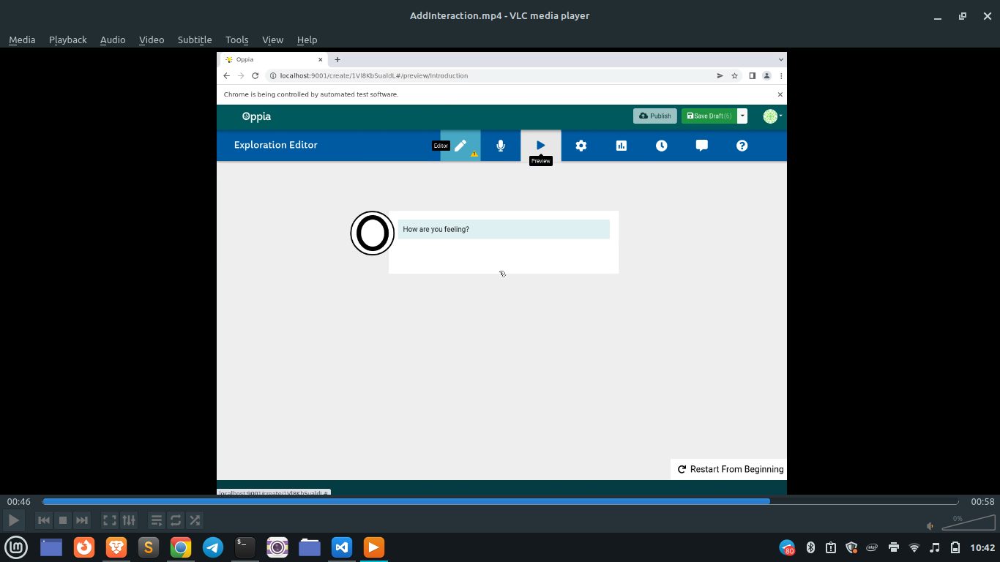

## Table of Contents

- [Introduction](#introduction)
- [Scenario](#scenario)
- [Prerequisites](#prerequisites)
- [Procedure](#procedure)
  - [Interpreting the Error Logs](#interpreting-the-error-logs)
    - [Understanding the Error Log](#understanding-the-error-log)
    - [Analyzing the Error](#analyzing-the-error)
  - [Reproducing the Flake](#reproducing-the-flake)
    - [Reproducing the Flake Locally](#reproducing-the-flake-locally)
    - [Reproducing the Flake on the CI Environment](#reproducing-the-flake-on-the-ci-environment)
  - [Understanding the Error](#understanding-the-error)
    - [Digging Deeper: Analyzing the Code](#digging-deeper-analyzing-the-code)
    - [Debugging E2E Tests: Additional Tools](#debugging-e2e-tests-additional-tools)
  - [Identifying the Root Cause](#identifying-the-root-cause)
  - [Implementing the Solution](#implementing-the-solution)
  - [Testing the Fix](#testing-the-fix)
    - [Run Relevant Test Locally](#run-relevant-test-locally)
    - [Run Relevant Test Repeatedly on CI](#run-relevant-test-repeatedly-on-ci)
  - [Conclusion](#conclusion)
    - [Appendix: Some Background on This Specific Flake](#appendix-some-background-on-this-specific-flake)
    - [We Value Your Feedback](#we-value-your-feedback)

## Introduction

Continuous Integration (CI) is a key practice in modern software development, where automated tests are run every time code is pushed to ensure that new changes don’t break the existing codebase. However, these tests don’t always go as planned, and sometimes we encounter issues unrelated to the actual code changes—known as CI flakes. These intermittent test failures often arise due to environmental factors, timing issues, or network instability.

This tutorial will guide you through fixing a common type of CI flake related to end-to-end (E2E) tests in Oppia, specifically those that involve waitFor statements. You will learn how to interpret error logs, trace the root cause of the flake, and implement a solution. While this tutorial focuses on a specific case, the steps and thought process covered will help you handle similar intermittent failures in the future.

> Troubleshooting CI flakes isn't just about fixing a single error—it’s about thinking critically, understanding the test execution flow, and implementing changes that ensure greater test reliability moving forward.

## Scenario

At Oppia, CI tests are automatically run on every pull request using GitHub Actions. However, CI pipelines can sometimes fail for reasons unrelated to the code changes themselves. These intermittent failures are referred to as CI flakes.

In this tutorial, we’ll investigate a CI flake where the test fails with the error: "Add Interaction button is not visible." We’ll walk through how to identify and fix this specific flake, building skills that will help you address similar issues in the future.

By following this example, you will not only fix this flake but also gain an understanding of how to approach and solve similar issues moving forward. More importantly, you’ll learn to think like a developer at Oppia—considering factors such as timing, environment, and test reliability as part of your troubleshooting toolkit.

## Prerequisites

Before you begin, ensure you have:
- Set up your development environment. (If you haven't, follow the [Oppia setup instructions](https://github.com/oppia/oppia/wiki/Installing-Oppia)).
- Familiarize yourself with how [E2E tests are used at Oppia](https://github.com/oppia/oppia/wiki/End-to-End-Tests).
- Familiarize yourself with the [Exploration Editor Page and its sub-tabs](https://oppia.github.io/#/TheExplorationEditor).

## Procedure

### Interpreting the Error Logs

When tackling any CI failure, especially one occurring in an E2E test, the first step is to carefully interpret the error logs. Logs provide a detailed view of what went wrong during the test, and understanding how to read them will help you quickly identify the root cause.

Here is the error log for this specific CI flake:

```python
Error: Add Interaction button is not visible.
Error
    at Object.visibilityOf (/home/runner/work/oppia/oppia/core/tests/webdriverio_utils/waitFor.js:123:39)
    at Object.click (/home/runner/work/oppia/oppia/core/tests/webdriverio_utils/action.js:34:17)
    at createNewInteraction (/home/runner/work/oppia/oppia/core/tests/webdriverio_utils/ExplorationEditorMainTab.js:595:18)
    at runMicrotasks (<anonymous>)
    at processTicksAndRejections (node:internal/process/task_queues:96:5)
    at async ExplorationEditorMainTab.setInteraction (/home/runner/work/oppia/oppia/core/tests/webdriverio_utils/ExplorationEditorMainTab.js:569:5)
    at async UserContext.<anonymous> (/home/runner/work/oppia/oppia/core/tests/webdriverio_desktop/additionalEditorFeatures.js:375:5)
```

> [!IMPORTANT]
> **Practice 1**: Breakdown the error logs to your understanding.
>
> **Hint**: Always read the traceback from the bottom of the stack trace upward. In this example, you should start with the async UserContext line and work your way up through the chain of function calls to pinpoint where the issue started.

#### Understanding the Error Log:

**Error Message**: The key message here is: Error: Add Interaction button is not visible. This indicates that the test failed because it could not find the "Add Interaction" button at the expected time.

**Traceback**: The lines in the log show the sequence of function calls leading up to the error. Let’s break down the key points:
- **at Object.visibilityOf (waitFor.js:123:39)**: This line tells us that the error occurred in the visibilityOf function, which is responsible for checking whether the "Add Interaction" button is visible. If the button is not visible, the test will fail at this point.
- **at Object.click (action.js:34:17)**: Next, we see that the click function in action.js was called. This function simulates clicking on the button, but since the button wasn’t visible, the action couldn’t be completed.
- **at createNewInteraction (ExplorationEditorMainTab.js:595:18)**: Here, we see that createNewInteraction in ExplorationEditorMainTab.js was responsible for attempting to interact with the "Add Interaction" button.
- The remaining lines indicate that the error is part of an asynchronous process happening within ExplorationEditorMainTab.js, showing the chain of events that led to the failure.

#### Analyzing the Error

> [!IMPORTANT]
> **Practice 2**: What action is the "E2E test user" trying to perform when this error is thrown? Which part of the code could potentially be causing the "Add Interaction button is not visible" error?

The "E2E test user" is attempting to add a new interaction (specifically, a 'TextInput' interaction) in the Exploration Editor. This action is part of a typical test sequence in which the user navigates through the editor, previewing, and editing interactions in the exploration. The error occurs during this step in the test:

```python
await explorationEditorMainTab.setInteraction('TextInput');
```

This line of code is located in additionalEditorFeatures.js and attempts to add an interaction in the Exploration Editor. However, the error suggests that the button needed to trigger this action was not visible at the time of execution, which caused the test to fail.

### Reproducing the Flake

Now that we understand where the error occurred, the next step is to try to reproduce the flake. Reproducing the issue is critical for verifying the problem and testing your fix.

#### Reproducing the Flake Locally

**Run the Test Locally**: Follow the [Oppia E2E Testing Guide](https://github.com/oppia/oppia/wiki/End-to-End-Tests#run-e2e-tests) to run the test on your local machine.

**Multiple Runs**: Run the test multiple times (at least 10 times) to increase the chances of encountering the flake since CI flakes are often intermittent. Running the test multiple times simulates the conditions under which flakes might appear.

> **Note**: Note: Running tests locally allows you to control the environment. However, CI flakes may behave differently in CI environments due to factors such as resource constraints, network conditions, and timing issues. Always keep this in mind when comparing local results with CI failures.

#### Reproducing the Flake on the CI Environment

If you cannot reproduce the flake locally, it may be specific to the CI environment. This can happen because CI environments often run tests in parallel with limited resources, which can introduce timing issues or race conditions that aren't present locally.

**Re-run CI Checks**: To reproduce the flake in the CI environment, navigate to the "Checks" tab in GitHub on your pull request and select "Re-run all jobs." This will restart the CI pipeline and potentially expose the flake again.

> **Note**: If you don’t have write access to the repository, you can ask a maintainer to restart the CI checks for you.

Pay close attention to recurring patterns in the error logs, such as delays, network latency, or other environment-specific clues that could contribute to the flake.

>[!IMPORTANT]
> **Practice 3**: Why do some flakes only appear in CI environments but not locally?
>
> Hint: Think about the differences in resources and network conditions between local environments and CI environments. Consider factors like test execution speed, resource availability, and whether tests run in parallel.

**Why are Flakes Often Not Reproducible Locally?**

Flakes may not always be reproducible locally due to differences between your local environment and the CI environment. In CI environments:
- Tests often run in parallel, increasing the chances of race conditions.
- Resources like CPU and memory are more limited compared to local machines, which can slow down test execution or lead to timing issues.
- Network delays are more common, especially when CI environments need to communicate with external services or load remote assets.

These factors can expose issues, such as timing problems or race conditions, that are not apparent in a local development environment where more resources are readily available.

Generally, replicating the CI environment locally isn't a feasible strategy because e.g. the hardware is different. However, developers can minimize environment-specific issues by designing tests that are resilient to timing and resource differences. This might involve:
- Using dynamic wait conditions rather than hard coded timeouts.
- Avoiding reliance on exact timings that could vary between environments.

When writing or updating tests, developers should always consider potential timing or resource-related issues, especially when targeting CI environments where resources are more constrained.

### Understanding the Error

When dealing with test failures, developers don’t stop at the error message. Instead, they question why the failure happened and whether external factors, such as timing or rendering delays, might have contributed to the problem.

In this case, the error message is clear: `Error: Add Interaction button is not visible.`
However, simply acknowledging the error isn’t enough. The key question we need to answer is: **Why isn’t the button visible?**

There are several possibilities to consider:
- **Test timing issues**: The test might be running too quickly, moving between steps before the UI elements are fully loaded.
- **UI rendering delays**: The "Add Interaction" button might take time to appear, but the test is attempting to click it before it becomes visible.
- **Page transitions**: The test might be navigating between tabs too fast, preventing the necessary UI elements from rendering properly before the next action is attempted.

These are the kinds of questions that are essential to narrowing down the issue.

#### Digging Deeper: Analyzing the Code

Let’s examine the part of the test code in `core/tests/webdriverio_desktop/additionalEditorFeatures.js` where the error occurred:

```python
await explorationEditorMainTab.setInteraction('EndExploration');
await explorationEditorMainTab.deleteInteraction();
await explorationEditorPage.navigateToPreviewTab();
await explorationEditorPage.navigateToMainTab();
await explorationEditorMainTab.setInteraction('TextInput');
```

This block of code follows a sequence of steps to set an interaction in the Exploration Editor. Let’s break down what’s happening step by step:
- Setting the "End Exploration" Interaction: The test first sets an interaction of type 'EndExploration' on the editor's main tab.
- Deleting the Interaction: The test then deletes the current interaction. This step is likely a cleanup action to ensure that the state is ready for a new interaction to be added.
- Navigating to the Preview Tab: The test navigates to the preview tab, likely simulating a user previewing the current state of the exploration.
- Returning to the Main Tab: After previewing, the test navigates back to the main tab, where interactions can be edited or added.
- Setting a New Interaction: Finally, the test attempts to set a new interaction of type TextInput, which is when the failure occurs. The error indicates that the test couldn’t find the "Add Interaction" button needed to perform this action.

> [!IMPORTANT]
> **Practice 4**: Familiarize yourself with the Exploration Editor page.
> 
> Since this E2E test deals with the Exploration Editor page, it’s essential to understand how this page works and how the various tabs (like the Main tab and the Preview tab) function.
> 
> To get familiar with the Exploration Editor page, refer to:
> - [Oppia Exploration Editor Guide](https://oppia.github.io/#/TheExplorationEditor)
> - [How to Access Oppia Webpages](https://github.com/oppia/oppia/wiki/How-to-access-Oppia-webpages)

Let’s analyze this further. The error occurs on the last line of the test code, where the test tries to set a TextInput interaction. However, a key step happens just before that—when the test navigates back to the Main Tab after visiting the Preview Tab.

> [!IMPORTANT]
> **Practice 5**: Based on the code above, why do you think the "Add Interaction" button might not be visible at this point in the test?
> 
> **Hint**: The error happens on the last line, but the root cause likely occurs earlier when the test switches back to the Main Tab. Investigate whether the UI has fully loaded before the test tries to set the interaction. You can try following the sequence in your local environment to observe how the UI transitions.

At this point, it's possible that:
- The main tab may not have fully loaded after returning from the preview tab.
- The necessary UI elements, such as the "Add Interaction" button, might not be rendered yet, causing the test to fail.

This is a common issue in UI testing, especially when dealing with asynchronous page transitions. If the page doesn’t have time to fully load, elements like buttons or input fields may not be interactable, leading to errors.

#### Debugging E2E Tests: Additional Tools

When debugging E2E tests, it’s helpful to leverage additional tools to get a clearer picture of what’s happening during test execution.

**Screenshots & Recordings from Local Tests**: To start debugging locally, run the relevant E2E tests in your local environment. By visually inspecting the UI and using [breakpoints to pause execution at critical points](https://github.com/oppia/oppia/wiki/Debug-end-to-end-tests#using-the-debugger), you can observe how elements like the "Add Interaction" button behave during the test. This is especially useful for understanding the cause of failures and diagnosing flakiness or timing issues.

If an E2E test fails locally, `WebdriverIO` automatically captures a screenshot of the UI at the exact moment of failure. These screenshots are stored in the `webdriverio-screenshots` folder. Reviewing these can help you understand the visual state of the UI at the time of the error.

In addition to screenshots, `WebdriverIO` can also record videos of your local test runs, saving them in the `webdriverio-video` folder. These recordings allow you to trace the sequence of events leading up to a failure, which is especially helpful for debugging UI transitions and timing issues. To enable these recordings locally, set the `LOCAL_VIDEO_RECORDING_IS_ENABLED` variable to 1 in the `wdio.conf.js` file. By default, videos are saved only when a test fails. If you want to save recordings for all tests, you can set the `saveAllVideos` option to true in the configuration file.

**Screenshots & Recordings from CI**: In addition to local debugging tools, Oppia supports video recordings and screenshots for tests running in CI environments. These tools are useful for identifying issues that occur only on CI or are difficult to reproduce locally. Oppia integrates test video recordings through GitHub Actions, capturing the entire test execution for later review. 

To enable screen recordings in CI, set the `VIDEO_RECORDING_IS_ENABLED` environment variable to `1` in your GitHub Actions workflow file. This setup will ensure that video recordings are captured and saved for each test run, providing a complete visual record of the test execution process.

For detailed instructions on setting up and using these debugging tools, [refer to the Oppia E2E Tests Debugging Wiki](https://github.com/oppia/oppia/wiki/Debug-end-to-end-tests).

Let’s now take a look at a screenshot from a previously documented E2E test failure, which was captured during a debugging session. The screenshot was part of a debugging doc created for a similar issue where the "Add Interaction" button was not visible.

> **Note**: You can also try capturing screenshots or video recordings by running the relevant E2E tests locally, as mentioned in the previous section. However, if you are unable to reproduce the flake locally, feel free to use the screenshot below as a reference.



If we take a look at the screenshot provided from the failed E2E test, we can see that the test is still on the Preview Tab. As a result, the "Add Interaction" button is not visible, and the test fails when trying to interact with it.

But we see that the step right before the error is responsible for moving back to the Main Tab, allowing interaction to be added:

```python
await explorationEditorPage.navigateToMainTab();
```

This step somehow fails to complete, which causes the error.

### Identifying the Root Cause

We suspect that the Main Tab might not be fully loaded, or that the "Add Interaction" button may not have been rendered completely when the test attempted to set the interaction. This could have caused the error.

To investigate this issue further, let’s examine the code responsible for navigating to the Main Tab, which can be found in `oppia/core/tests/webdriverio_utils/ExplorationEditorPage.js`.

> [!IMPORTANT]
> **Practice 6**: In your code editor, locate the function responsible for navigating to the Main Tab in `oppia/core/tests/webdriverio_utils/ExplorationEditorPage.js`.
>
> **Tip**: Use your code editor’s search functionality to quickly find it.

Here’s the function responsible for navigating to the Main Tab in the test suite:

```python
this.navigateToMainTab = async function() {
   await action.waitForAutosave();
   await action.click('Main tab button', navigateToMainTabButton);
   // Wait for the appearing and disappearing action to get completed after
   // the main tab button is clicked.
   // eslint-disable-next-line oppia/e2e-practices
   await browser.pause(2000);
 };
 ```

Let’s break down what each line of the `navigateToMainTab` function does:
- `await action.waitForAutosave()`; This ensures that any ongoing autosave operations on the page are completed before navigating to the Main Tab. Autosave is crucial for preventing data loss, so we need to ensure it finishes before continuing.
- `await action.click('Main tab button', navigateToMainTabButton)`; This line simulates a user clicking on the "Main Tab" button in the UI. The `action.click()` method is used to click the button, and navigateToMainTabButton refers to the UI element that represents the Main Tab button.
- `await browser.pause(2000)`;
This introduces an explicit wait of 2 seconds (2000 milliseconds) before proceeding. It forces the browser to wait for a short period before moving forward with further actions.

> [!IMPORTANT]
> **Practice 7**: Looking at the function navigateToMainTab, which part of the code do you think could lead to flaky tests?

The concerning line seems to be `- await browser.pause(2000)`;

This introduces a fixed delay of 2 seconds, but it doesn't guarantee that the Main Tab has fully loaded. If the page takes longer than expected to load (due to network delays or system performance issues), the next action (setting the interaction) might still be executed before the tab is ready. This could cause errors, similar to the one we're investigating.

> [!IMPORTANT]
> **Practice 8**: Now that we know the potential issue causing the flake and have an explanation for why it’s occurring, can you think of a solution? (The problem occurs because the Main Tab hasn't been fully loaded.)

### Implementing the Solution

> **Note**: Now that we’ve pinpointed the root cause of the flaky behavior, there are different ways to resolve the issue. It’s important to discuss potential solutions with your team before implementing them. Below is one approach to solve this issue.

To fix this problem, we should wait for the Main Tab to fully load by waiting for the "Add Interaction" button to become visible. This button indicates that the tab is ready for interaction.

A common instinct might be to increase the time for a fixed delay, for example, 10000 milliseconds, to give the UI more time to load. This would look something like this:

```python
await browser.pause(10000); // Wait for 10 second before proceeding
```

While this could be useful for local debugging (since it gives you some “free time” to poke around on the local server at the breakpoint that it introduces), it is generally not a good idea to do it in the actual test.

>[!IMPORTANT]
> **Practice 9**:  Can you think of reasons why adding a fixed delay is not a good idea?
> **Hint**: Consider how tests behave in different environments, such as your local machine versus the CI environment.

At first, adding a fixed delay might seem like a quick solution to the issue. However, waiting for a fixed time has several downsides:
- **Unreliable**: The time it takes for a page or element to load can vary depending on network conditions, system performance, or other factors. A fixed wait time might work sometimes but fail when conditions change, especially in CI environments.
- **Inefficient**: Adding arbitrary delays can make tests unnecessarily long. If the page loads in 500ms, waiting for 1000ms wastes time. Conversely, if the page takes longer to load, a fixed delay might not be long enough, leading to failures.
- **CI Environment Variability**: CI environments often run tests in parallel with limited resources, which means they are more prone to delays. Relying on fixed waits can make tests flaky, as they might not always account for slower performance in CI.

Instead of waiting for a fixed time, it’s better to wait for specific UI elements or events that indicate the page is ready for interaction. In this case, we should wait for the "Add Interaction" button to become visible, ensuring that the Main Tab is fully loaded.

First, we add a class `e2e-test-open-add-interaction-modal` to the "Add Interaction" button in `state-interaction-editor.component.html`. This will help us select the element easily in our test:

```python
<button type="button"
  class="btn btn-secondary oppia-add-interaction-button e2e-test-open-add-interaction-modal"
  (click)="openInteractionCustomizerModal()"
  *ngIf="editabilityService.isEditable()">
  + ADD INTERACTION
</button>
```

> **Note**: Using classes of the form e2e-* is a standard Oppia convention for selecting elements in E2E tests. This helps us clearly identify the elements we are interacting with in the tests.

Next, we add a dynamic wait function to wait for the "Add Interaction" button to be visible, ensuring that the Main Tab is fully loaded:

```python
await waitFor.visibilityOf(
  addInteractionButton, 'Add Interaction Button is not visible'
);
```

> [!IMPORTANT]
> **Practice 10**:  In `additionalEditorFeatures.js`, where should you call the `waitForPreviewTabToLoad` function to solve the problem? 
> 
> Should we create a separate function for waiting for the element to load and call that in `navigateToMainTab`, or should we add the wait directly into the `navigateToMainTab` function?

Whenever we navigate to a new tab, we should ensure that the action is fully completed before continuing. Incorporating the wait directly into the action function is important to ensure that the tests are robust.

This is why most E2E utility functions include pre-checks and post-checks (in the form of `wait`statements). The pre-check ensures that conditions are met before performing the action, and the post-check ensures that the action has fully completed before moving on.

Having these as separate functions runs the risk of developers forgetting to call the wait function, which leads to flaky tests. To avoid this, we should include the wait directly in the `navigateToMainTab` function.

Here’s the updated function:

```python
this.navigateToMainTab = async function() {
   await action.waitForAutosave();
   await action.click('Main tab button', navigateToMainTabButton);
   await waitFor.visibilityOf(
      addInteractionButton, 'Add Interaction Button is not visible'
   );
};
```

By updating the `navigateToMainTab` function to dynamically wait for the "Add Interaction" button, we ensure that the Main Tab is fully loaded before performing any further actions. This approach eliminates the need for fixed waits and makes the test more reliable and robust across different environments.

### Testing the Fix

Now that we've implemented the changes, it’s time to test the solution to ensure that the flake is resolved. Properly testing the fix involves running the relevant E2E tests multiple times in both local and CI environments to confirm stability.

#### Run Relevant Test Locally

You can begin by running the relevant test multiple times locally to confirm that the fix works.

Run the relevant test at least 10 times locally to ensure that the flake no longer occurs. This helps catch any remaining intermittent issues and verifies that the fix is effective in your local environment. To run only the relevant suite for our example, use the following command in your Docker setup: `make run_tests.e2e suite=additionalEditorFeatures`.

#### Run Relevant Test Repeatedly on CI

To run the relevant test many times in the CI environment, you can configure the CI workflow to run it multiple times on the CI server.

Here’s how:
- Open the file `.github/workflows/e2e_lighthouse_performance_acceptance_tests.yml`.
- Find the step that runs the E2E tests and modify it to focus only on the test suite that has been identified as flaky. For example, if your test command looks like this:
```yml
command: >
           VIDEO_RECORDING_IS_ENABLED=0;
           xvfb-run -a --server-args="-screen 0, 1285x1000x24"
           python -m scripts.run_e2e_tests --skip-install
           --skip-build --prod_env
```
- You can adjust it to run only the relevant suite by adding the suitable flag, like so:
```yml
command: >
           VIDEO_RECORDING_IS_ENABLED=0;
           xvfb-run -a --server-args="-screen 0, 1285x1000x24"
           python -m scripts.run_e2e_tests --skip-install
           --skip-build --suite=additionalEditorFeatures --prod_env
```
- Now the workflow `step check_test_suites_to_run:
uses: ./.github/workflows/check_test_suites_to_run.yml.`
generates a matrix, and for each entry in the matrix, the modified command will run. Regardless of the files in the matrix, the test suite you’ve specified (in this case, `additionalEditorFeatures`) will be executed. Update the job name to reflect the suite you’re testing. For instance, change: 
`name: e2e_test (${{ matrix.os }}, ${{ matrix.suite.name }})` to: `name: e2e_test (${{ matrix.os }}, additionalEditorFeatures)`

Alternatively, you could also modify the output of the check_test_suites_to_run.yml action to generate the matrix more efficiently, ensuring that only the relevant suite is run multiple times.

This will ensure that only the specified suite is run multiple times, reducing unnecessary execution of irrelevant test suites and saving time.

**Important Considerations for CI Reruns**

Run Tests on Your Own Fork: To reduce the load on the main oppia/oppia CI runners, it’s recommended to only run tests repeatedly on PRs opened against branches on your own fork. For example, open a PR to merge changes from your feature branch to your fork’s develop branch, rather than the oppia/oppia develop branch.
For more detailed information, you can refer to the [Debug Frontend Tests Guide](https://github.com/oppia/oppia/wiki/Debug-frontend-tests#run-tests-repeatedly-on-ci). The same approach applies to E2E tests.

## Conclusion

By following the steps outlined in this tutorial, you should now have the ability to identify and resolve CI flakes related to `waitFor` statements in E2E tests. The key steps to addressing these issues involve:
- Carefully interpreting error logs to understand what went wrong.
- Diagnosing the root cause by analyzing the test execution flow and identifying potential asynchronous loading issues.
- Implementing a solution that ensures tests dynamically wait for necessary elements to be fully visible and interactable before proceeding.
It’s important to test your fix thoroughly by running the tests multiple times in both local and CI environments. Consistent success across 10 or more test runs will indicate that the flake has been effectively resolved.

### Appendix: Some Background on This Specific Flake

The flake that we investigated in this tutorial was originally reported in [Issue #16102 on GitHub](https://github.com/oppia/oppia/issues/16102). The initial approach to resolve this issue was to wait for the preview tab to load, instead of waiting for the main tab. While this solution worked, it is not considered the most logical one. The reason it likely succeeded is that it increased the time taken for the tests to execute, allowing the UI to render in time, but this doesn’t address the underlying issue in a systematic way.

For the sake of this tutorial, we adjusted the original solution to follow a more logical approach. Rather than relying on the preview tab wait, we introduced a solution that waits for specific elements in the main tab to become visible and interactable before proceeding.

You can find the original approach to solving this flake in the following debugging document: [Debugging Doc](https://docs.google.com/document/d/1MF11icS6NSjwFIHZaJRDHb_RziPFxlZNDRCPgwHIUqo/edit?tab=t.0#heading=h.g2kvwe3z972w). However, as discussed, this solution was most likely a coincidence and not an ideal approach for ensuring test stability.
For more detailed guidance on debugging and running E2E tests on the local server, be sure to refer to the [Oppia Debugging Docs](https://github.com/oppia/oppia/wiki/End-to-End-Tests#debugging-failing-e2e-tests).

### We Value Your Feedback

Did you find this tutorial useful? Or, did you encounter any issues or find things hard to grasp? Let us know by opening a discussion on [GitHub Discussions](https://github.com/oppia/oppia/discussions/new?category=tutorial-feedback). We would be happy to help you and make improvements as needed!
