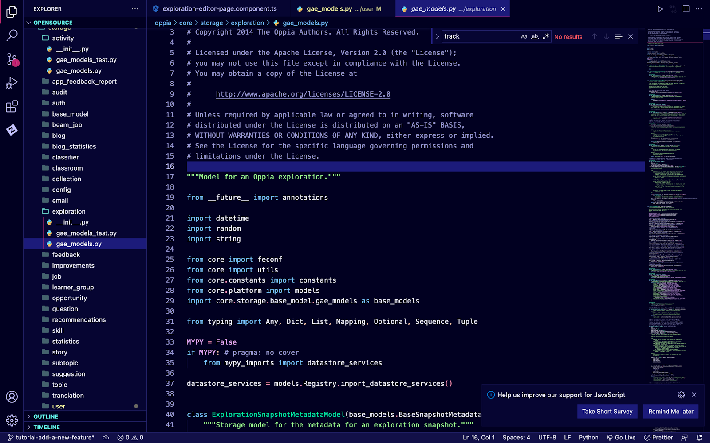
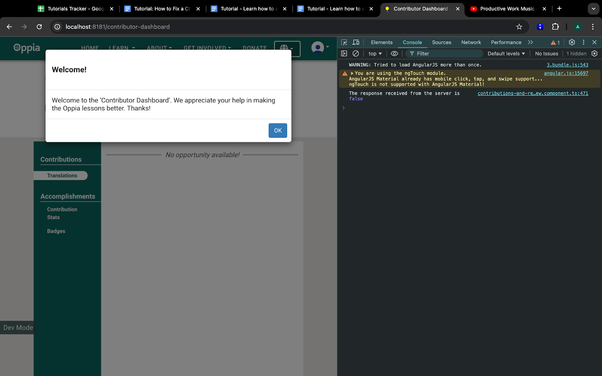

## Table of Contents

- [Introduction](#introduction)
- [Scenario](#scenario)
- [Prerequisites](#prerequisites)
- [Procedure](#procedure)
  - [Stage 1: Planning and Design](#stage-1-planning-and-design)
    - [Understanding the Requirements](#understanding-the-requirements)
    - [Key Considerations](#key-considerations-where-to-track-the-users-first-visit)
    - [High-Level Workflow](#high-level-workflow)
  - [Stage 2: Backend Development](#stage-2-backend-development)
    - [Storage Layer](#storage-layer)
    - [Service Layer](#service-layer)
    - [Controller Layer](#controller-layer)
  - [Stage 3: Frontend Implementation](#stage-3-frontend-implementation)
    - [Setting Up Methods for Backend Communication](#setting-up-methods-for-backend-communication)
    - [Creating the UI Component](#creating-the-ui-component)
    - [Incorporating the Logic to Handle New Component](#incorporating-the-logic-to-handle-new-component)
  - [Stage 4: Testing the Feature](#stage-4-testing-the-feature)
- [Conclusion](#conclusion)
  - [We Value Your Feedback](#we-value-your-feedback)

## Introduction

In this tutorial, you will learn how to add a new full-stack feature to Oppia. This guide will cover the entire process, from designing the feature to implementing it on both the backend and frontend. You’ll also learn how to manage communication between the frontend and backend through an API (Application Programming Interface)—which allows different parts of the application to send and receive data. By following this step-by-step guide, you’ll gain insights into how developers at Oppia approach implementing new features, enabling you to tackle similar challenges in the future.

## Scenario

The goal is to create a Welcome Modal for the Contributor Dashboard that appears when a user visits the page for the first time. The modal will display the following static text:

*“Welcome to the Contributor Dashboard. We appreciate your help in making the Oppia lessons better. Thanks!”*

After the user closes the modal, they will be able to proceed with their usual tasks. The modal will not appear again on future visits.

## Prerequisites

Before you begin, ensure you have:
- Set up your development environment. (If you haven't, follow the [Oppia setup instructions](https://github.com/oppia/oppia/wiki/Installing-Oppia)).
- Basic understanding of frontend and backend development with [Angular](https://angular.dev/overview) & [Python](https://www.python.org/about/gettingstarted/)
- Familiarity with the Oppia codebase and its file structure. (If not, refer to the [Oppia codebase overview](https://github.com/oppia/oppia/wiki/Overview-of-the-Oppia-codebase)).

## Procedure

When adding a new feature, it’s essential to approach the task with a structured workflow. This ensures that each component of the feature is thoughtfully designed, implemented, and integrated. Here's the recommended workflow to follow:

### Recommended Workflow for Developing Full-Stack Features

**Planning and Design:**

- **Understand the Requirements**: Begin by thoroughly understanding the feature requirements. This involves discussions with users, conversations with the design team, or referring to the feature request documentation.
- **Plan the Data Flow**: Think about what data the frontend needs to display or manipulate and what actions the backend should support. This will help you identify the specific API endpoints you need to create.
- **Design the Architecture**: Map out how the frontend, backend, and database will interact. This includes designing how data will flow from the user interface to the backend, and how the backend will retrieve or store data.

**Backend Development:**

- **Identify the Required API Endpoints**: Before starting on the backend, ask yourself: *What functionality does the backend need to provide to the frontend?* Design API endpoints that will allow the frontend to send and receive the necessary data. These API endpoints will act as communication channels between the frontend and backend.
- **Implement Data Models and Storage**: Depending on the feature, you may need to modify existing data models or create new ones. Focus on how data will be stored and retrieved to meet the needs of the feature.
- **Handle Data Manipulation and Processing**: Think about how the backend will process the data. What operations does the backend need to perform on the data? This could involve creating, updating, or deleting records in the database, as well as performing computations on the data..

**Frontend Development:**

- **Build the User Interface (UI)**: Create the layout and define user interactions that align with the feature’s requirements. Ensure the design offers a smooth u23ser experience.
- **Use Backend APIs to Retrieve Data**: Implement the necessary frontend logic to call backend APIs and retrieve the required data. Handle the display of this data and ensure that user actions (like submitting a form) trigger the correct API requests.
- **Ensure Frontend-Backend Communication**: Make sure that the frontend and backend can communicate effectively through the designed APIs. Test API calls to ensure data is being sent and received as expected.

Following this workflow, let’s walk through the process of adding the Welcome Modal feature to Oppia.

### Stage 1: Planning and Design

#### Understanding the Requirements

The first step in building any feature is understanding its requirements. For this Welcome Modal feature, the requirement is to show a welcome message to the user when they first visit the Contributor Dashboard and ensure that the modal does not appear on subsequent visits—**only if they have closed the Welcome Modal**. If the user refreshes the page or navigates away without closing the modal, it should appear again the next time they visit.

While this feature might seem straightforward at first glance, there are some underlying complexities. One challenge is tracking whether the user has previously closed the modal, as we want it to persist until closed, across different sessions and devices.

> [!IMPORTANT]
> **Practice 1**: Which data type would be best to denote whether the user has closed the Welcome Modal or not? Should we use a string, integer, or boolean data type?

We could store the number of times the user has visited the page (using an integer) or a simple yes/no value (using a boolean). In this case, we only care whether the user has closed the modal or not. A boolean variable (true or false) is ideal for tracking this.

> [!IMPORTANT]
> **Practice 2**:  Where should we store this variable (frontend or backend) to keep track of the user's status whether they have closed the Welcome Modal or not?
>
> **Hint**: Consider factors like persistence and consistency across sessions and devices.

#### Key Considerations: Where to Track the User's First Visit?

We need to store a value that tracks whether the user has closed the modal. This can be done on either the frontend (client-side) or backend (server-side).

- Frontend (Client-Side) Storage:
    - Pros: Easy to implement using local storage or cookies.
    - Cons: Not persistent across devices. If the user clears their browser data or switches devices, the modal will reappear, which is not ideal.
- Backend (Server-Side) Storage:
    - Pros: More robust, ensuring consistency across all devices and browsers. Once a user has seen the modal on one device, they won’t see it again, even if they log in from another device.
    - Cons: Requires backend changes, making it slightly more complex to implement.

Since we need to track the user's visit across devices, backend storage is the better choice for ensuring consistency and persistence across different sessions and environments.

>[!IMPORTANT]
> **Practice 3**:  Write a high-level design of the feature.
>
> **Hint**: Think about the user flow when accessing the feature. How should the system react to each user action?

#### High-Level Workflow

- The user visits the Contributor Dashboard for the first time.
- The backend checks if the user has closed the Welcome Modal by querying a flag stored in the database.
- If the flag indicates the modal has not been closed, the backend sends a response to the frontend to trigger the Welcome Modal.
- The frontend displays the modal.
- Once the user closes the modal, the backend updates the flag, marking that the user has seen the modal.

> **Note**: If the user refreshes the page without closing the modal, it will appear again the next time they visit the Contributor Dashboard. This is intentional to ensure the modal is only dismissed when the user explicitly closes it.


### Stage 2: Backend Development

First, we need to figure out where to store the value. At Oppia, we use the Google Cloud Datastore, and we interface with it from Python using Cloud NDB. Please refer to this [wiki page](https://github.com/oppia/oppia/wiki/Overview-of-the-Oppia-codebase) if you haven’t, before going further in this tutorial, as the stages from here will require a basic understanding of the Oppia codebase architecture.

As per Oppia’s backend architecture, here’s what we would need to do:
1. Add the new property to an existing model class or create a new model class.
2. Add the new property to a corresponding domain object class or create a new domain object class.
3. Create a new service function or update an existing one so that the function updates this new property to True once the user has visited the Contributor Dashboard.
4. Create a new handler(s) or update the existing handler function(s) which will be responsible for returning the property to the frontend and calling the service layer to update the property once the user has visited the Contributor Dashboard.

#### Storage Layer

When adding the new property, we need to decide whether to incorporate it into an existing model or create a new one. This new property will indicate whether the user has visited the Contributor Dashboard at least once (True) or not (False).

>[!IMPORTANT]
> **Practice 4**: Should we add a new property to an existing model or create a new model? Which one is better and why?
>
> **Hint**: Consider simplicity and feasibility.

While adding a new model is feasible, it might introduce unnecessary complexity unless there’s a compelling reason to do so. The better approach often depends on whether there is already an existing model where this new property naturally fits.

**Reviewing the Existing Models**: At Oppia, [models](https://github.com/oppia/oppia/wiki/Storage-models) are organized into directories based on functionality, such as `oppia/core/storage`. For instance, models related to opportunities can be found in `core/storage/opportunity/gae_models.py`.

To make an informed decision, it’s important to review the existing models to see if one of them aligns with the purpose of tracking whether the user has visited the Contributor Dashboard.

Here’s a way to begin:

- Explore the file descriptions at the beginning of model files, such as in `oppia/core/storage/exploration/gae_models.py`.



The file description at line 17 of this file describes it as "Model for an Oppia exploration."

Similarly, reviewing other `gae_models.py` files will help identify whether an existing model is suitable for storing this new property.

>[!IMPORTANT]
> **Practice 5**:  Review the models at `oppia/core/storage` as mentioned above. Which model file should we modify?
>
> **Hint**: Check the file description for each model and determine if the new property aligns with the scope of the models in that file.

In our case, the file `oppia/core/storage/user/gae_models.py` appears to be the most appropriate choice. This file contains models that handle user-related data at Oppia, and since the property we want to add tracks whether a user has closed the Welcome Modal on the Contributor Dashboard, it aligns with the purpose of these models.

Next, we need to decide which specific model within `oppia/core/storage/user/gae_models.py` should be updated.

>[!IMPORTANT]
> **Practice 6**:  Review the models defined in the file `oppia/core/storage/user/gae_models.py`. Can you determine which specific model should be updated ?
>
> **Hint**: : Examine each model in the file and consider where it makes the most sense to add the property that tracks whether the user has closed the Welcome Modal on the Contributor Dashboard.

Upon reviewing the models, the best candidate for modification seems to be:

```python
 class UserSettingsModel(base_models.BaseModel):
    """Settings and preferences for a particular user.
    Instances of this class are keyed by the user id.
    """
```

This model stores user settings and preferences, which makes it an appropriate place to track whether the user has closed the Welcome Modal. Since it's already designed to store information about a user's preferences, adding a boolean property here (e.g., `has_closed_welcome_moda`l`) will fit naturally with the existing structure.

We’ll begin by adding a new property to the storage model `UserSettingsModel` in `core/storage/user/gae_models.py`. This property will track whether the user has closed the Welcome Modal, regardless of how many times they have visited the Contributor Dashboard.

Make sure to add a brief, accurate comment describing what this attribute holds. For example:

```python
# Flag to check whether the user has closed the Welcome Modal on the Contributor Dashboard.
has_closed_contributor_dashboard_welcome_modal = ndb.BooleanProperty(default=False, indexed=True)
```
> Note: For more information on how ndb model classes work, including the available property types, refer to the [ndb documentation](https://googleapis.dev/python/python-ndb/latest/model.html#google.cloud.ndb.model.BooleanProperty). Also, note that "properties" are sometimes referred to as "fields."

Next, we need to update the domain model so that the application can interact with the new property in the storage model. The domain model implements operations on the data from the storage model and acts as the interface between the storage layer and other parts of the application.

We’ll add the property `has_closed_contributor_dashboard_welcome_modal` to the `UserSettings` domain model, which represents user-related settings.

>[!IMPORTANT]
> **Practice 7**: Modify the constructor (`__init__` function) of the `UserSetting`s domain model to initialize this new property. The constructor is responsible for creating new instances of `UserSettings` and initializing them with relevant user-related properties.

Here's how we modify the constructor to include this property:

Domain Model: `core/domain/user_domain.py`

```python
def __init__(
        self,
        ...,
        has_closed_contributor_dashboard_welcome_modal: bool = False,
        ...):
    """Initializes a UserSettings object.

    Args:
        user_id: str. The unique ID of the user.
        email: str. The user email.
        roles: list(str). The roles assigned to the user.
        has_closed_contributor_dashboard_welcome_modal: bool. Flag to check whether
            the user has closed the Welcome Modal on the Contributor Dashboard. Defaults to False.
        ...
    """
    self.has_closed_contributor_dashboard_welcome_modal = (
        has_closed_contributor_dashboard_welcome_modal)
```

The `__init__` function is also referred to as the constructor because it is the function that is called when a new instance of the `UserSettings` class is created. It initializes the instance with the provided arguments and sets up the object's properties. Inside the constructor, the value of `has_closed_contributor_dashboard_welcome_modal` is assigned to the corresponding instance variable (`self.has_closed_contributor_dashboard_welcome_modal`), which is used to track the state of whether the user has closed the modal. By setting the default value of this property to `False`, we ensure that, by default, users are assumed not to have closed the modal until they actually do so.

We also need to ensure the new property is correctly handled in the `UserSettingsDict`. The `UserSettingsDict` is a `TypedDict` that mirrors the structure of the `UserSettings` domain model. It helps in transferring user-related data between the frontend and backend, ensuring that both layers are in sync. To correctly handle the new property, we need to update the UserSettingsDict to reflect the changes made in the `UserSettings` domain model.

In the class `UserSettingsDict`, add the property:

```python
has_closed_contributor_dashboard_welcome_modal: bool
```

Now that we have updated both the storage model (to store the data) and the domain model (to interact with the data), our system is equipped to track whether the user has closed the Welcome Modal.

#### Service Layer

Next we need to create a service function which will update the value of `has_closed_contributor_dashboard_welcome_modal`

File: `oppia/core/domain/user_services.py`

>[!IMPORTANT]
> **Practice 8**: Write a function to update the `has_closed_contributor_dashboard_welcome_modal` property to True for a specific user. This will indicate that the user has closed the Welcome Modal on the Contributor Dashboard.
>
> **Hint**: Here’s the pseudo code which you need to implement: 
> Fetch the current settings of the user, from these settings update the property `has_closed_contributor_dashboard_welcome_modal`, and save the user settings.
> 
> The `get_user_settings` function is already defined in the `oppia/core/domain/user_services.py` file. This function will fetch the user’s current settings. Similarly, the `save_user_settings` function is available in the same file to save any updates made to the user’s settings.

Here’s what one implementation of the function could look like:

```python
def record_user_visited_contributor_dashboard(user_id):
    """Updates has_closed_contributor_dashboard_welcome_modal to True 
    for the user with the given user id, but only saves if a change is made.

    Args:
        user_id: str. The unique ID of the user.
    """
    user_settings = get_user_settings(user_id)

    # Check if the flag is already True, avoid saving if no change is needed
    if not user_settings.has_closed_contributor_dashboard_welcome_modal:
        user_settings.has_closed_contributor_dashboard_welcome_modal = True
        save_user_settings(user_settings)
```

#### Controller Layer

Next, we need to modify or add a handler that retrieves this information from the backend and sends it to the frontend. For this tutorial, let’s create a new handler.

This handler will be responsible for:
- Retrieving the value of the `has_closed_contributor_dashboard_welcome_modal` property.
- Updating this property once the user has closed the Welcome Modal.

>[!IMPORTANT]
> **Practice 9**: Can you locate the file where we need to add our new handler?
>
> **Hint**: Refer to this wiki page: https://github.com/oppia/oppia/wiki/Contributor-dashboard#code-pointers, where code pointers of Contributor Dashboard are mentioned

Per the [wiki](https://github.com/oppia/oppia/wiki/Contributor-dashboard#code-pointers) page, [core/controllers/contributor_dashboard.py](https://github.com/oppia/oppia/blob/develop/core/controllers/contributor_dashboard.py): Handles fetching opportunities and Contributor Dashboard metadata such as eligible translatable text content. Thus we would want to add our handler to this file.

>[!IMPORTANT]
> **Practice 10**: Can you create a new handler for our use case ?
>
> **Hint**: Refer to the existing handlers and based on existing code conventions and our use case try writing the new handler

Here’s what one approach would look like -

```python
class ContributorDashboardVisitHandler(base.BaseHandler):
   """Handles the logic for checking and updating the visit flag for the contributor dashboard."""


   URL_PATH_ARGS_SCHEMAS = {}
   HANDLER_ARGS_SCHEMAS = {
       'GET': {},
	 'POST': {},
   }


   @acl_decorators.open_access
   def get(self):
       """Handles GET requests to check if the user has visited the contributor dashboard."""
       user_id = self.user_id
       user_settings = user_services.get_user_settings(user_id)
       self.render_json({
           'has_visited_contributor_dashboard': user_settings.has_closed_contributor_dashboard_welcome_modal
       })


   @acl_decorators.open_access
   def post(self):
       """Handles POST requests to update the visit flag for the contributor dashboard."""
       user_id = self.user_id
       user_services.record_user_visited_contributor_dashboard(user_id)
       self.render_json({
           'status': 'success'
       })
```

> Note: When you first implement this change, existing user models may not have the `has_closed_contributor_dashboard_welcome_modal` property. In real-world scenarios, this would require a migration job (such as a Beam job) to ensure the new property is added to all existing user models. For details on handling such migrations, refer to [Oppia’s Beam Job Guide](https://github.com/oppia/oppia/wiki/Apache-Beam-Jobs).

In the above approach we have one for get request which will be triggered when the Contributor Dashboard is visited, it will return a boolean value whether the user has seen the “Welcome Wodal” or not.
And we have a post request which is going to record that the user has closed the Welcome Modal.

Now it’s the time to attach the handler to the endpoint, before that we would want to create a new endpoint. Here’s what it could look like - `/contributor-dashboard-visit`. Remember that the endpoint should convey its meaning as to why this endpoint is called. In our case it denotes that it’s related to the Contributor Dashboard’s visit activity.

>[!IMPORTANT]
> **Practice 11**: Attach the handler to the above mentioned endpoint.
>
> **Hint**: We have all the attachments mentioned in the main.py file. Look at how other handlers have been attached to their respective endpoints and try to do the same.

In `main.py` 

```python
  get_redirect_route(
       r'/contributor-dashboard-visit',
       contributor_dashboard.ContributorDashboardVisitHandler
   ),
```

Great, now we have the backend ready for our feature. Now’s the time to move on to the front-end part.


### Stage 3: Frontend Implementation

With the backend now prepared, the next step is to build the frontend, ensuring that the Welcome Modal is displayed correctly when a user accesses the Contributor Dashboard for the first time. The frontend implementation will involve setting up API requests to interact with the backend, defining service methods, and creating the modal itself.

To implement this feature, we need to understand which files in the frontend codebase should be modified or created. Following Oppia's codebase architecture, we need to identify the following:

1. **File to Handle Network Calls to the Backend**: We need to identify a file that handles all network requests for the Contributor Dashboard. This is where we will define methods to send and receive data from the backend API (which was set up earlier). This file should handle fetching user data and updating the `has_closed_contributor_dashboard_welcome_modal` property.
2. **Service File to Define Methods for Backend Communication**: The next step is to identify the  file that defines methods to communicate with the network layer. The service layer is a critical abstraction that allows components to request data without worrying about the underlying API details. In this case, the service file will define methods such as `getUserSettings` to fetch the user's settings and `updateUserSettings` to update the `has_closed_contributor_dashboard_welcome_modal` property. These methods will call the functions defined in the network file from step 1.
3. **Component to Render the Welcome Modal**: Now, we need to determine which component will render the Welcome Modal when a user visits the Contributor Dashboard. This component will be responsible for displaying the modal and ensuring that the modal state (whether it has been closed) is updated correctly by calling the backend through the service layer.
4. **Location for the New Modal Component**: Since we are creating a new modal component for the Welcome Modal, we need to decide where in the codebase this component should live. Typically, this would be placed in a directory where reusable UI components are stored. This location should follow the established structure of the project to ensure consistency.

>[!IMPORTANT]
> **Practice 12**: To successfully implement the Welcome Modal feature on the Contributor Dashboard, you need to modify or create various files in the frontend codebase. Based on the pointers mentioned in the above section, identify the exact files and code locations where the following actions should occur:
> 1. Handling Network Calls to the Backend: This involves identifying the file that will handle fetching and updating the `has_closed_contributor_dashboard_welcome_modal` property from the backend.
> 2. Defining Service Methods for Backend Communication: Determine which service file will define methods such as `getUserSettings` and `updateUserSettings` to interact with the network layer, abstracting away the API details for the component.
> 3.Rendering the Welcome Modal: Find the component responsible for rendering the Welcome Modal when a user visits the Contributor Dashboard.
> 4. Storing the New Modal Component: Decide on the location where the modal component should be placed in the codebase, adhering to Oppia's file organization standards.
>
> **Hint**: Review the following resources [Overview of the Oppia Codebase](https://github.com/oppia/oppia/wiki/Overview-of-the-Oppia-codebase) & [Contributor Dashboard](https://github.com/oppia/oppia/wiki/Contributor-dashboard) and explore the file structure at `oppia/core/templates/pages/contributor-dashboard-page/` to understand the organization of frontend components and services. This will help you pinpoint the exact files and locations for adding the new logic.

Based on Oppia’s architecture, here are the files we need to modify or create:

1. File to Make Network Calls to the Backend:
    - `contribution-opportunities-backend-api.service.ts` located at `oppia/core/templates/pages/contributor-dashboard-page/services/`.
    - This file is responsible for handling all network requests related to the Contributor Dashboard.
2. Service File to Call Backend API Methods:
    - `contribution-opportunities.service.ts` located at `oppia/core/templates/pages/contributor-dashboard-page/services/`.
    - This service will define methods that make use of the network call methods and will be invoked by the component.
3. Component to Render the Welcome Modal:
    - `contributions-and-review.component.ts` located at `oppia/core/templates/pages/contributor-dashboard-page/contributions-and-review/`.
    - This is the component where we will add logic to render the Welcome Modal.
4. Location for the New Modal Component:
    - `modal-templates/` located at `oppia/core/templates/pages/contributor-dashboard-page/`.
    - We will create a new folder `modal-templates` if it doesn't exist and add the new modal component here.

These identified code pointers will guide us in implementing the frontend logic step-by-step.

#### Setting Up Methods for Backend Communication

First, let's create methods to communicate with the backend API. These methods will be responsible for checking if a user has closed the Welcome Modal and for recording the closure once the user interacts with it.

>[!IMPORTANT]
> **Practice 13**: Write code for network calls to the backend.
>
> **Hint**: Review the existing code in `contribution-opportunities-backend-api.service.ts` and analyze the pattern followed for other network requests.

Creating Methods in `contribution-opportunities-backend-api.service.ts`

In the file `oppia/core/templates/pages/contributor-dashboard-page/services/contribution-opportunities-backend-api.service.ts`, add the following methods:

```typescript
async getUserDashboardWelcomeModalStatus(): Promise<{ has_closed_contributor_dashboard_welcome_modal: boolean }> {
  return await this.http.get<{ has_closed_contributor_dashboard_welcome_modal: boolean }>('/contributor-dashboard-welcome-modal-status').toPromise();
}
async recordUserClosedWelcomeModal(): Promise<void> {
  return await this.http.post<void>('/contributor-dashboard-close-welcome-modal', {}).toPromise();
}
```

These methods handle all backend communication required for this feature:
-  `getUserDashboardWelcomeModalStatus`: Makes a GET request to determine if the user has previously closed the Welcome Modal and returns the result as a boolean.
- `recordUserClosedWelcomeModal`: Sends a POST request to update the status after the user has seen the Welcome Modal.

Creating Service Methods in `contribution-opportunities.service.ts`

>[!IMPORTANT]
> **Practice 14**: Implement service methods to call backend API.
>
> **Hint**: Check how other service methods are defined in `contribution-opportunities.service.ts` and follow a similar pattern.

Next, we’ll create service methods to call the backend API methods. In the file `oppia/core/templates/pages/contributor-dashboard-page/services/contribution-opportunities.service.ts`, add the following methods:

```python
async fetchUserWelcomeModalStatus(): Promise<boolean> {
  const response = await this.contributionOpportunitiesBackendApiService.getUserDashboardWelcomeModalStatus();
  return response.has_closed_contributor_dashboard_welcome_modal;
}
async updateUserClosedWelcomeModalStatus(): Promise<void> {
  await this.contributionOpportunitiesBackendApiService.recordUserClosedWelcomeModal();
}
```

These service methods will be used by the component to interact with the backend:
- `fetchUserWelcomeModalStatus`: This method will  fetch the status of whether the user has closed the Welcome Modal.
- `updateUserClosedWelcomeModalStatus`: This method updates the status in the backend once the user closes the modal.

Now that our methods for backend communication are ready, let's set up the Welcome Modal.

#### Creating the UI Component
> Note: This tutorial does not focus on UI design, so we will create a minimal layout for the Welcome Modal.

>[!IMPORTANT]
> **Practice 15**: Write HTML template for the Welcome Modal
>
> **Hint**: Look at the existing modal templates in `modal-templates/` to understand the structure and styling conventions.

Create a new HTML file for the Welcome Modal `welcome-modal.component.html` in oppia/core/templates/pages/contributor-dashboard-page/modal-templates/:

```html
<div>
  <div class="modal-header">
    <h3 class="modal-title">Welcome!</h3>
  </div>
  <div class="modal-body">
    <p>
      Welcome to the ‘My Contributions Tab’. We appreciate your help in making the Oppia lessons better. Thanks!
    </p>
  </div>
  <div class="modal-footer">
    <button class="btn btn-primary" (click)="closeModal()">OK</button>
  </div>
</div>
```

The modal has a simple structure with a header, body, and footer. The "OK" button triggers the `closeModal()` method to close the modal.


> [!IMPORTANT]
> **Practice 16**: Write typescript code for the Welcome Modal.
>
> **Hint**: - Check the existing modal components in the `modal-templates/` folder to see how they are structured.

Next, create the TypeScript file for the modal: oppia/core/templates/pages/contributor-dashboard-page/modal-templates/welcome-modal.component.ts:

```python
import { Component } from '@angular/core';
import { NgbActiveModal } from '@ng-bootstrap/ng-bootstrap';

@Component({
  selector: 'welcome-modal',
  templateUrl: './welcome-modal.component.html'
})
export class WelcomeModalComponent {
  constructor(private activeModal: NgbActiveModal) {}

  closeModal(): void {
    this.activeModal.close();
  }
}
```

The `WelcomeModalComponent` is an Angular component that defines the behavior of the modal. The `closeModal` method is triggered when the user clicks the "OK" button, closing the modal.

To make sure that Angular recognizes our new modal component, declare it in the module file: `contributor-dashboard.module.ts`.

Add `WelcomeModalComponent` to both `declarations` and `entryComponents`:

```python
@NgModule({
  declarations: [
    // other components...
    WelcomeModalComponent
  ],
  entryComponents: [
    // other components...
    WelcomeModalComponent
  ],
  // other module metadata...
})
export class ContributorDashboardPageModule { }
```

**`declarations`**: Registers the WelcomeModalComponent to make it available within this module. 
**`entryComponents`**: Ensures that Angular can dynamically load the `WelcomeModalComponent` when it is triggered (i.e., when the modal is opened).

#### Incorporating the Logic to Handle New Component

Now, we need to decide where to trigger the code to in `contributions-and-review.component.ts` file to open the modal. 

> [!IMPORTANT]
> **Practice 17**:  Determine the right place in the code to trigger the Welcome Modal.

> 
> **Hint**: The code should be placed in a lifecycle hook that gets called every time the page loads.

Per our requirements, the ideal place seems to be the component’s initialization method.

**Why Use ngOnInit?**

[`ngOnInit`](https://v17.angular.io/api/core/OnInit) is the Angular lifecycle hook that is called after Angular has initialized all data-bound properties of a component. This makes it the right place to perform initialization logic, such as fetching data or displaying a modal based on a condition.

**Adding Logic in the ngOnInit Method**

In the `contributions-and-review.component.ts` file, modify the ngOnInit method to call the service method that fetches the user's visit status:

```python
this.contributionOpportunitiesService.fetchUserWelcomeModalStatus().then(
  (hasClosedModal: boolean) => {
    console.log('The response received from the server is ', hasClosedModal);
    this.hasClosedWelcomeModal = hasClosedModal;

    // Open the modal if the user has not closed the Welcome Modal before.
    if (!this.hasClosedWelcomeModal) {
      this.openWelcomeModal();
    }
  })
  .catch((error: any) => {
    console.error('An error occurred while fetching the Welcome Modal status:', error);
  });
```

**Explanation:**

- The `ngOnInit(`)` method fetches the user's modal status when the component is initialized.
- If the user has not closed the modal before, it calls `openWelcomeModal()` to display the Welcome Modal.

**Implementing the Modal Trigger Method**

Next, implement the method to open the modal:

```python
openWelcomeModal(): void {
  const modalRef = this.ngbModal.open(WelcomeModalComponent);

  modalRef.result.then(() => {
    // Call the method to record the user closing the modal.
    this.contributionOpportunitiesService.updateUserClosedWelcomeModalStatus().then(
      () => {
        console.log('User closed Welcome Modal status updated successfully.');
      },
      (error) => {
        console.error('An error occurred while updating the user Welcome Modal status:', error);
      }
    );
  }).catch((error) => {
    console.error('An error occurred while closing the modal:', error);
  });
}
```
**Explanation:**

- `openWelcomeModal()`: Uses Angular’s ngbModal service to open the WelcomeModalComponent.
- After the modal is closed, it triggers `updateUserClosedWelcomeModalStatus()` to update the backend about the user's interaction with the modal.

**Recap of How Everything Fits Together:**

- Backend Communication: We set up API methods in the backend service and service layer to check if the user has closed the Welcome Modal and to record their interaction once it’s closed.
- Modal Setup: We created a modal template and component to display a welcome message.
- Triggering the Modal: We added logic in `ngOnInit()` to fetch the user's modal status and determine whether to show the modal.
- User Experience: If the user hasn't closed the modal before, the modal is displayed. Once they close it, their action is recorded.

### Stage 4: Testing the Feature

Now that the feature is implemented, it's essential to test it thoroughly to ensure it works as expected. This stage will involve launching your local development server, navigating to the http://localhost:8181/contributor-dashboard, and checking if the Welcome Modal behaves as intended.

Start your local development server. Ensure that your server is running without errors. Go to http://localhost:8181/contributor-dashboard and make sure you are logged in with a user account that has `never closed` the Welcome Modal before.

Upon your first visit to the Contributor Dashboard, you should see the Welcome Modal appear.



Close the Modal and refresh the page or navigate away and come back to the Contributor Dashboard. This time, the modal should not appear.

> [!IMPORTANT]
> **Practice 18**: Test the feature more thoroughly.
>  1. Log out from the current user and create a new user account using a different mock email address. Repeat the steps above to verify that the Welcome Modal appears for the new user on their first visit and not on subsequent visits.
> 2. Log in with an existing user account that has already visited the Contributor Dashboard. Confirm that the modal does not appear.
>
> If all the above tests pass, it implies that feature does work as we intended it to be.

## Conclusion

Congratulations! You've successfully implemented a new feature for Oppia that displays a Welcome Modal on the Contributor Dashboard when a user visits the page for the first time. Through this tutorial, you have learned how to manage the flow of data from the backend to the frontend, including creating new APIs, designing a modal component, and integrating the feature into the existing codebase.

**Next Steps:**

If you're looking to enhance this feature or handle more complex scenarios, here are a few ideas:

1. Customize the Modal: Modify the UI design to make the Welcome Modal more engaging or to match Oppia's branding more closely. You can explore using custom animations, additional styling, or interactive elements to improve the user experience.
2. Extend the Feature: Introduce more personalized content in the modal, such as the user's role, username, or recent contributions. This would help in making the welcome message more relevant and engaging for each user.
3. Unit Tests: Write unit tests for the backend and frontend code to ensure the feature functions correctly and prevent future regressions. You can refer to the following resources for guidance on writing tests:
    - [Backend Tests Guide](https://github.com/oppia/oppia/wiki/Backend-tests)
    - [Frontend Tests Guide](https://github.com/oppia/oppia/wiki/Frontend-tests)
    - Analyze the existing unit tests in the codebase to understand the best practices and conventions used at Oppia.
4. Feature Gating: Consider feature gating your new feature. Feature gating allows you to control the availability of a feature for different user groups or environments. This helps in gradually rolling out the feature, testing its impact, and minimizing risks. You can learn more about feature gating from the [Launching New Features Guide](https://github.com/oppia/oppia/wiki/Launching-new-features).

### We Value Your Feedback

Did you find this tutorial useful? Or, did you encounter any issues or find things hard to grasp? Let us know by opening a discussion on [GitHub Discussions](https://github.com/oppia/oppia/discussions/categories/tutorial-feedback). We would be happy to help you and make improvements as needed!
